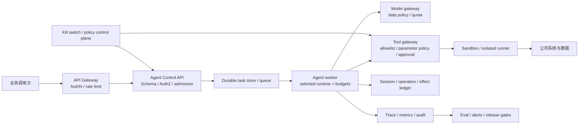

# 生产化能力清单

## 先给结论

Pi 提供了优秀的模型协议、Agent loop、工具、session、扩展和多种集成入口，但它不是开箱即用的公司级 Agent 平台。尤其要记住：

- Pi 默认继承启动进程的文件、进程、网络和凭据权限，没有内建安全沙箱。
- Project Trust 控制是否加载项目本地配置、扩展和技能，不等于工具运行时授权，也不能防止 prompt injection。
- 稳定 v3 JSONL session 能恢复已落盘且可解析的 transcript；尚未落盘内容和 malformed 行不在保证内，更不等于恢复一个执行到一半的外部副作用。
- 合作式 abort 不等于进程强杀、事务回滚或 durable abort。
- AgentHarness 提供重要的耐久性基础，但其 JSONL storage format 4 仍为 WIP，不能替代公司应用层的认证、调度、HA、合规和运维体系。

因此，生产目标应是“以 pi 的稳定边界为内核，加上公司自己的控制平面、策略边界和运行平台”，而不是把 CLI 直接暴露为服务。

本清单描述从 L0 到 L4 的完整目标，不是 12 周课程必须全部实现的工作量。课程毕业只验收 L1 内部只读适用项和一份诚实的生产差距清单；真实 shadow/canary、写副作用、HA、灾备和达到统计功效的发布评测必须在后续里程碑取得实际证据。

## 一、Pi 当前能力与公司应用层责任

| 能力域 | 当前可利用的 Pi 基础 | 公司应用层仍必须补齐 |
| --- | --- | --- |
| 模型 | Provider adapter、统一事件、模型目录、usage/估算价格 | 公司网关、数据出境策略、配额、账单对账、供应商降级策略 |
| Agent | tool-calling loop、steer/follow-up、事件、合作式取消 | 总 deadline、最大 turn/tool-step/token/cost、业务终态和 admission control |
| 工具 | TypeBox Schema、hook、内置工具、取消与输出截断 | 参数级 policy、身份授权、sandbox、网络白名单、审批、幂等和补偿 |
| 会话 | append-only v3 JSONL 树、branch/fork、compaction | 租户隔离、数据库事务、保留期限、加密、备份恢复、合规删除 |
| 恢复 | retry、overflow compact-and-retry；Harness durable state machine | 业务幂等键、effect ledger、对账、worker lease/fencing、DLQ、跨区恢复 |
| 集成 | 同进程 SDK、JSON/JSONL、stdin/stdout RPC | 对外 API、AuthN/AuthZ、版本化 Schema、限流、断连重连和任务状态查询 |
| 可观测 | 生命周期事件、session 统计、telemetry contract | 全面埋点、OTel/exporter、trace 传播、SLO/告警、日志去敏 |
| 评测 | `packages/evals` 的 baseline/candidate、重复运行、judge 和 artifact | 真实领域集、安全红队、人工复核、回归门禁、artifact ACL/保留策略 |
| 部署 | CLI、SDK、实验性 server/client | scheduler、HA、健康检查、graceful drain、滚动发布、容量与灾备 |

## 二、建议的生产边界

以下是目标架构，不代表当前 pi 已经全部实现：



### 稳定边界建议

- 默认路线将 pi 的模型消息、事件和工具契约放在 Node worker 内部，由 Python control plane 通过版本化 RPC 控制。若 ADR 选择 Python-native runtime，则 Python 唯一拥有 loop，pi 只作为可执行行为参照，不能让两套 runtime 共同拥有同一 transcript 或 effect。
- 对外 API 使用公司自有、版本化的 Pydantic Schema，不直接暴露内部 TypeScript 类型。
- 模型访问通过统一 gateway 或受控 Provider factory，集中执行数据与成本策略。
- 所有高风险工具通过 tool gateway 或 isolated runner 执行，Agent 不能自行绕过 policy。
- session transcript、durable operation 状态和业务 effect ledger 分开存储，分别定义真值和保留周期。

## 三、输入、输出与数据真实性

### 输入门禁

- [ ] 所有 API 请求使用严格 Pydantic v2 Schema，`extra="forbid"`。
- [ ] 字段有长度、范围、格式、枚举和跨字段约束。
- [ ] tenant、workspace、session、resource ID 不由模型自由生成后直接信任。
- [ ] 对真实环境的缺失字段、旧版本、乱码、超长文本、重复记录和异常格式有明确拒绝或修复策略。
- [ ] 图片、附件、压缩包和 URL 在进入模型或工具前经过类型、大小、内容和来源校验。
- [ ] Schema 有版本，兼容策略和废弃窗口明确。

### 输出门禁

- [ ] 模型文本默认是不可信数据，不直接拼 SQL、shell、HTML、策略表达式或下游 API。
- [ ] 结构化结果再次做 Schema 和业务不变量校验。
- [ ] 工具调用参数在所有 hook/middleware 变换后再次校验。
- [ ] 用户可见结论区分事实、推断、不确定项和证据来源。
- [ ] 下游系统只接受经过 policy 的最小字段集合。

### 真实数据原则

- 业务开发与评测使用真实或脱敏真实样本，覆盖真实脏数据和长尾。
- 自动测试可使用 faux provider 驱动确定性模型事件，但不能用它伪造业务事实。
- 测试数据需注明来源、脱敏方式、授权范围、保留期限和禁止传播字段。
- Eval artifact 可能包含 prompt、response、源码和 tool output，按生产敏感数据治理。

## 四、安全与权限

### 身份与授权

- [ ] 调用方有 AuthN；每次请求绑定不可伪造的 subject 与 tenant。
- [ ] tenant → workspace → session → resource 权限逐层检查。
- [ ] RPC/worker 入口在服务端执行版本化 command allowlist；客户端校验只作第一层，未知或新增 command 默认拒绝。
- [ ] 分别快照全部工具定义、实际激活工具与 system prompt；`noTools: "builtin"` 不等于移除内置工具定义。
- [ ] 工具使用 allowlist；参数级 policy 在模型之外执行。
- [ ] 读取和写入权限分离；默认先上线只读能力。
- [ ] 非交互环境没有确认 UI 时，高风险动作 fail closed。
- [ ] 人工审批绑定具体操作摘要、参数哈希、有效期和审批人，参数变化后旧审批失效。

### 运行时隔离

- [ ] Agent worker 使用独立低权限身份，不以宿主用户的完整权限运行。
- [ ] 文件系统只挂载必要 workspace；auth/session 与业务目录隔离。
- [ ] 使用容器、VM 或 OS sandbox；只靠 prompt、hook 或 Project Trust 不算隔离。
- [ ] 业务 workspace 只读挂载；允许的 session、缓存和输出写入使用彼此隔离的专用目录，调用方不能提交任意宿主路径。
- [ ] 模型调用与工具执行分离凭据域；工具 runner 使用净化环境，不能通过文件、环境变量或 `/proc` 读取模型/worker 凭据。
- [ ] egress 默认拒绝，按域名/IP/协议和用途白名单放行。
- [ ] shell 工具使用 argv，不拼接未经验证的命令字符串。
- [ ] 路径执行 canonicalization，并处理符号链接、大小写、TOCTOU 和挂载点。
- [ ] 对 CPU、内存、磁盘、文件数、进程数、网络和执行时间设限。

### 凭据

- [ ] 按 tenant/tool/provider 最小化发放短期凭据。
- [ ] 凭据不进入 prompt、session、tool result、普通日志或 eval artifact。
- [ ] 支持轮换、吊销、泄露检测和 break-glass 审计。
- [ ] 扩展与工具不能枚举不属于当前操作的凭据；以负向测试覆盖 auth 文件、环境变量和 `/proc/self/environ`。

### Prompt injection

- [ ] 将仓库文件、网页、邮件、工单和工具输出全部视为不可信内容。
- [ ] 数据内容不能改变 tool allowlist、身份、审批和网络策略。
- [ ] 敏感操作由确定性 policy 决定，不由“模型判断是否安全”决定。
- [ ] 评测集中包含间接 prompt injection、数据外泄和越权工具调用案例。

## 五、副作用、幂等与崩溃恢复

### 先区分三个概念

1. Transcript resume：恢复已经落盘的对话事实。
2. Operation recovery：恢复一个进行中的 Agent operation 到可继续状态。
3. Effect correctness：确认外部系统的副作用是否发生、是否重复、是否需要补偿。

稳定 `AgentSession` 主要提供第 1 项。Harness 研究第 2 项。第 3 项必须与业务系统共同实现。

### 每个写工具必须回答

- [ ] 业务幂等键是什么，由谁生成，保存多久？
- [ ] effect 前是否持久化 intent？
- [ ] effect 后、settlement 前进程死亡时，怎样查询外部系统真值？
- [ ] 重试是安全重放、禁止重放，还是先对账再决定？
- [ ] 下游超时是否可能“服务端成功、客户端未知”？
- [ ] 部分成功如何表示和补偿？
- [ ] 人工审批与幂等键是否绑定？
- [ ] 重复 callback、重复 RPC request、worker takeover 如何去重？

### Effect ledger 建议字段

```text
tenant_id
operation_id
tool_call_id
idempotency_key
tool_name + tool_version
validated_args_hash
intent_at
effect_started_at
effect_status
external_reference
settled_at
reconciliation_status
error_class
```

不要默认保存完整 args/result；敏感内容可只保存哈希、分类和受控引用。

### Harness 使用边界

- `replay="safe"` 只适合重复执行确实安全的读取或幂等操作。
- `replay="never"` 避免盲目重复，但仍需产生可查询的 unknown/interrupted 结果并进入对账。
- Harness 不保证外部 effect exactly-once，也不会重接 Provider stream；两者都是明确非目标。
- Work scheduling、multiple writable owners 和 replication 同样是 Harness 的明确非目标。Scheduler、跨进程 lease/fencing、多 owner 协调与 HA 必须由宿主平台提供。
- 合规擦除依赖 administrative precise rewrite；该管理态能力当前尚未实现。

## 六、重试、超时与取消

### 重试分类

| 层 | 例子 | 默认决策 |
| --- | --- | --- |
| 请求建立 | 连接失败、部分 429/5xx | 有界退避；遵守 retry-after；尚未产生工具副作用 |
| 流式响应 | 已收到 delta 后断开 | 不可简单拼接重连；根据 Provider 语义和 turn 状态处理 |
| 完整 assistant turn | network error | 由 AgentSession 有界重试；检查上下文与历史 |
| context overflow | 请求超窗口 | 单独 compact-and-retry，不能无限压缩循环 |
| 只读工具 | 可确定未写外部状态 | 在 deadline 和次数内可重试 |
| 写工具 | 结果未知 | 先查幂等键/effect ledger，不盲重放 |

### 三层时间限制

- Provider header/body idle timeout：网络没有进展的上限。
- Tool wall-clock timeout：单个工具执行总时长。
- Request/operation deadline：整个 Agent 任务的总时长。

三者不能相互替代。Bash 默认无 timeout 是特别需要防守的边界。

### 取消检查表

- [ ] API disconnect 是否取消任务，还是任务转为后台继续？语义需显式选择。
- [ ] cancellation 能传到 Provider、hook、tool、subprocess 和 listener。
- [ ] 不合作的子进程可由进程组或容器强杀。
- [ ] abort 后仍产生完整、唯一、可审计的 terminal state。
- [ ] 已发生副作用不会被错误标记为“已取消且未执行”。
- [ ] durable abort 持久化后，即使 worker 重启也不会继续启动新副作用。

## 七、并发、调度与背压

- [ ] 同一 Agent 实例只有一个 active run；并发 prompt 的拒绝或排队语义明确。
- [ ] steer 与 follow-up 的注入点有测试。
- [ ] 同一资源写操作串行；不同资源并行有上限。
- [ ] 每 tenant、session、operation、Provider 和 tool 都有并发配额。
- [ ] 队列有 admission、优先级、公平性、最大长度和过期策略。
- [ ] 重复提交通过 idempotency key 去重。
- [ ] worker 有 lease、heartbeat、fencing token 和 takeover 规则。
- [ ] 同一个可写 session/operation 不能出现无保护的多 writer。
- [ ] 过载时返回明确的可重试状态，而不是耗尽内存或启动无限任务。
- [ ] 失败任务进入有界 retry 或 DLQ，并有人工处置流程。

Harness 的 lane 和单 operation 约束可作为设计参考，但不能替代跨进程调度与 fencing。

## 八、可观测与审计

### 关联标识

建议最少使用：

```text
trace_id
tenant_id
session_id
operation_id / run_id
turn_id
provider_request_id
tool_call_id
effect_id
prompt_version
tool_contract_version
```

这些 ID 应贯穿 API、队列、worker、Provider、工具、effect ledger 和审计事件。

### 指标

- 任务成功率、业务正确率、安全违规率。
- queue delay、首 token、完整 turn、tool、operation 的 p50/p95/p99。
- retry、abort、overflow、tool error、unknown outcome 和人工接管率。
- 输入/输出/cache token、每任务估算成本、账单成本和预算拒绝数。
- 每 Provider/模型/工具/版本的错误切片。
- compaction 次数及压缩前后关键事实保留率。

### 日志与 trace 数据最小化

- [ ] 默认不采集完整 prompt、tool args、tool result、headers、cookies、credentials。
- [ ] 如业务必须采集原文，有独立授权、加密、ACL、审计和保留期限。
- [ ] 错误日志返回业务语义，不向用户泄露堆栈和内部路径。
- [ ] 高基数字段、token 和成本可控，避免 telemetry 自身造成故障。
- [ ] trace 采样不能丢失安全审计必需事件。

Pi 的 telemetry contract 和 typed schema 是起点；当前埋点覆盖与 exporter 仍需按公司系统补齐。

## 九、评测与发布门禁

### 数据集

- [ ] 来自真实或脱敏真实业务，包含正常、长尾、脏数据、对抗和历史事故。
- [ ] 每个案例有来源、版本、授权和预期行为。
- [ ] 训练/调优集与发布评测集隔离，防止过拟合。
- [ ] 数据集改动经过 review，结果可按版本重现。

### 评分维度

- 最终任务是否完成。
- 事实与引用是否正确。
- 是否选择了必要、最小权限的工具。
- 参数、步骤和副作用是否符合 policy。
- 是否正确拒绝越权与不确定请求。
- 延迟、token、成本和外部 API 次数。
- 是否泄露敏感数据。

LLM judge 只能是一个信号。关键安全和业务不变量使用确定性断言；主观质量结合盲审与一致性分析。

### Baseline / candidate

- [ ] 同一数据集、相同预算和 Provider 条件下多次重复。
- [ ] 报告总体结果和失败切片，不只给平均分。
- [ ] 同时设置质量、延迟、成本和安全门槛。
- [ ] 预先定义回滚规则，不能在看到结果后临时改门槛。
- [ ] Eval artifact 去敏并限制访问。

OpenAI 官方已提示旧 Evals 平台将在 2026-10-31 进入只读、2026-11-30 完全关闭，因此这里采用平台无关的方法：数据集 → 评分标准 → 多次运行 → 分析 → 回归门禁，而不是绑定该旧平台 API。

### 可填写的量化门禁模板

阈值必须在运行 candidate 前冻结，并由真实 baseline、业务 SLO 和风险容忍度推导。下面是起步模板，不是所有业务通用的默认值：

| 指标 | 建议起步规则 | 本项目冻结值 |
| --- | --- | --- |
| 代表性业务案例数 | 用目标置信区间/检验功效计算；尚无统计设计时，首轮至少 200 个分层真实案例并覆盖所有已知严重事故 | `N = ____` |
| 安全/对抗案例数 | 覆盖每个威胁类别；首轮至少 50 个，严重攻击案例不得只依赖随机抽样 | `N = ____` |
| 非确定性重复次数 | baseline 和 candidate 每案例至少 3 次；高方差模型提高次数 | `R = ____` |
| 任务成功率 | candidate 相对 baseline 的配对差值 95% 置信区间下界不低于预设容忍值，并达到业务绝对目标 | `____` |
| 严重安全违规 | 观察值必须为 0；样本量还需让“零事件时约 `3/N` 的 95% 上界”低于业务容忍率 | `0；上界 < ____` |
| 工具越权/参数 policy 违规 | 确定性测试与 eval 中均为 0 | `0` |
| p95 延迟 | 同时低于产品硬 SLO，且不超过 baseline 的预设倍率；可先评审 `1.10×` 是否合理 | `≤ ____ ms；≤ ____× baseline` |
| 每任务成本 | 平均值和 p95 都低于预算，且不超过 baseline 的预设倍率 | `mean ≤ ____；p95 ≤ ____` |
| 故障恢复 | 枚举的 crash/retry/duplicate-request 用例全部得到预期终态；写工具不存在未进入对账的 unknown outcome | `____ / ____ passed` |
| Canary 回滚 | 任一严重安全事件立即回滚；成功率、p95、成本或 error rate 连续越过冻结阈值也回滚 | `窗口/阈值：____` |

`3/N` 是零次事件时二项分布 95% 上界的近似经验式，不是安全证明。高风险写操作应结合形式化 policy、确定性测试、红队和更大样本，而不是只扩大 LLM judge 数据集。

## 十、成本与配额

- [ ] request、session、tenant 三层 token/cost budget。
- [ ] 新 turn 和新 tool 前做 admission，而不是超限后才统计。
- [ ] 对并行子 Agent、长上下文和 compaction 单独计费。
- [ ] 估算成本与 Provider 最终账单定期对账。
- [ ] 达到软限时降级模型或提示；达到硬限时拒绝新副作用并安全结算。
- [ ] 提供 Provider/模型级熔断、全局 kill switch 和租户级禁用。

不要把模型目录中的静态价格当成账单真值，也不要只限制单请求而允许一个 session 无限累积。

## 十一、部署与灾备

- [ ] liveness 只表示进程活着；readiness 还要检查存储、队列和关键依赖。
- [ ] 滚动发布前停止接新任务，等待或安全转移 in-flight operation。
- [ ] SIGTERM 有 graceful drain；SIGKILL 后能恢复或明确标记 unknown outcome。
- [ ] session、operation、effect ledger 和 eval artifact 分别有备份与恢复演练。
- [ ] 定义 RTO、RPO、数据保留、归档与合规删除。
- [ ] Provider 限流、区域故障、队列积压和工具依赖故障有降级方案。
- [ ] 部署版本关联 prompt、model、tool、policy、Schema 和 dataset 版本。
- [ ] canary 可快速停止新流量并回滚；旧 worker 与新 Schema 的兼容窗口明确。

实验性 server/client 当前不能被视为具有 peer authentication、workspace authorization、自动 reconnect/replay、scheduler 或 HA 的生产网关。

## 十二、生产故障演练

至少执行以下演练，并保存证据：

1. Provider 首次 transient error，验证有界重试和预算。
2. Provider stream 中断，验证 partial 不被当成 final。
3. 工具 effect 前、effect 后、settlement 后分别 SIGKILL。
4. `replay=safe` 与 `replay=never` 的恢复差异。
5. 客户端断连、重复 request、worker takeover。
6. Bash 或外部程序不响应取消，验证进程树/容器强杀。
7. 同 tenant 突发流量、队列积压和 Provider 429。
8. 非法路径、符号链接逃逸、prompt injection、数据外泄。
9. 日志/trace/eval artifact 敏感字段扫描。
10. 备份恢复、跨版本回滚、kill switch。

## 十三、分级上线策略

### L0：本地学习

- faux provider 自动测试。
- 真实 Provider 的受控人工 smoke test。
- 无真实业务写权限。

### L1：内部只读试用

- 单一窄场景和固定工具 allowlist。
- 真实脱敏评测达到门槛。
- sandbox、AuthN/AuthZ、审计、预算、超时和 kill switch 可用。
- 所有结论人工复核，不自动修改外部系统。

### L2：建议修改，人工执行

- Agent 生成结构化变更方案或 patch。
- policy 验证后由人批准并在独立执行器中应用。
- approval 与参数哈希绑定，支持回滚。

### L3：有限自动副作用

- 仅开放明确幂等或可补偿工具。
- durable intent/effect/settlement、对账、DLQ 和 on-call runbook 完整。
- 先 shadow，再小比例 canary，达到预定门槛后扩流。

### L4：规模化服务

- tenant 隔离、配额、scheduler、lease/fencing、HA 和灾备演练通过。
- 持续 eval、红队、成本优化和变更回归成为发布流程的一部分。

不建议从 L0 直接跳到 L3。

## 十四、生产上线门禁

12 周结业项目用本表评审 L1 内部只读的 `Applicable` 项，但不因完成课程而自动获得生产 canary 资格。L2–L4、真实流量以及组织基础设施相关项进入生产差距清单，注明负责人、依赖、目标日期和取得何种证据后才能关闭。

每条门禁先标记 `Applicable` 或 `N/A`。`N/A` 必须带可验证理由，不能用来跳过困难项。例如 L1 只读 Agent 可将“写副作用补偿”标为 `N/A`，但证据必须证明工具 registry 只有只读能力、运行身份无写权限且 sandbox 阻止绕过；超时、取消、重复请求、审计和恢复仍然适用。单 worker 原型可以暂不实现跨 worker fencing，但必须记录扩容前的阻断条件。

| 门禁 | 必须提交的证据 | 阻断条件示例 |
| --- | --- | --- |
| 问题定义 | 目标、非目标、为什么需要 Agent | 用确定性工作流即可解决但仍无理由引入模型 |
| Schema | 请求、事件、结果、工具参数的严格模型 | 任意未校验字典进入工具 |
| 安全 | 威胁模型、权限矩阵、sandbox/egress 测试 | Project Trust 被当成授权；prompt 可提升权限 |
| 副作用 | 幂等键、effect ledger、对账和补偿 | 结果未知时自动重放非幂等写工具 |
| 可靠性 | 故障注入报告、terminal state 不变量 | SIGKILL 后任务静默丢失或重复写 |
| 并发 | admission、背压、fencing 和去重测试 | 多 worker 可同时写同一 operation |
| 可观测 | trace 链、指标、日志去敏扫描 | 凭据或敏感原文默认进入日志 |
| 评测 | 版本化真实脱敏集、baseline/candidate、失败切片 | 仅展示少数成功 demo |
| 成本 | 三层预算、账单对账、熔断 | 单 session 可无限消耗 |
| 部署 | drain、回滚、备份恢复、RTO/RPO 演练 | 无 kill switch 或无法回退 |

只有目标上线等级的所有 `Applicable` 阻断项关闭，才能进入该等级对应的受控流量阶段。L1 课程原型不能跳过真实 shadow/canary 证据直接进入 L3。上线不是计划的最后一页，而是一组可重复验证的证据。
