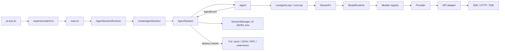
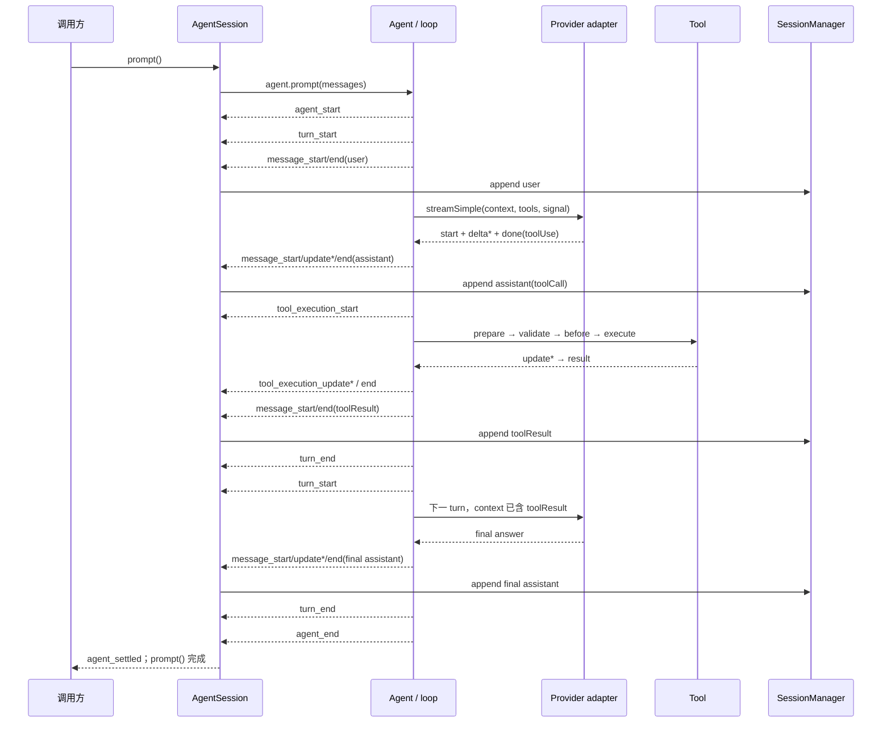
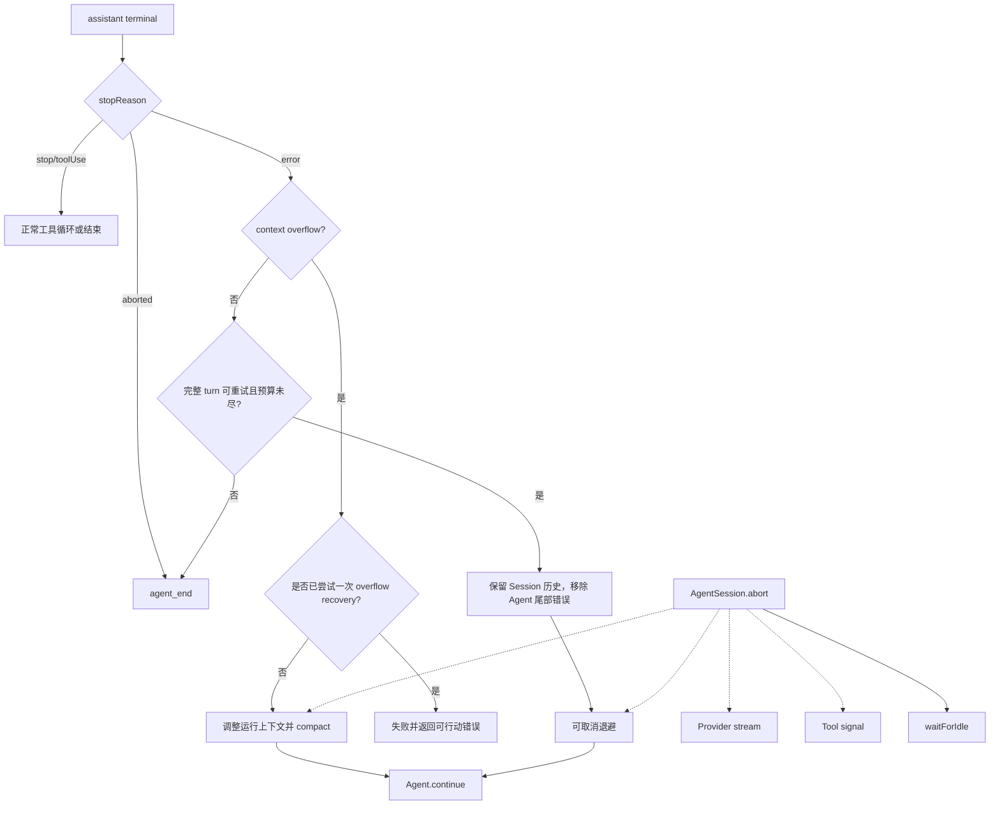

# 源码阅读与实验手册

## 使用方式

这不是完整源码导览，而是一条用于建立正确心智模型的“窄路径”。每次阅读遵循以下步骤：

1. 先写下你预测的输入、事件顺序、状态变化和终态。
2. 运行最小示例或聚焦测试。
3. 先读公共类型和测试，再完整阅读目标函数。
4. 只在当前问题需要时继续追依赖。
5. 用 Python 复刻同一行为，或通过故障注入证伪自己的理解。

不要把 pi 简化成经典 ReAct。它是模型驱动的 tool-calling loop，具备行动—观察闭环，但控制器依据 assistant/toolCall/toolResult/stopReason 推进，不要求模型输出显式 `Thought → Action → Observation` 文本。

## 一、先记住运行时控制关系

下图表示对象的控制/调用关系，不是构造时间顺序。初次启动时，`createAgentSessionRuntime(createRuntime)` 会先调用 factory；factory 创建 services、`Agent` 与 `AgentSession`，最后才构造 `AgentSessionRuntime`。



### 每层只负责什么

| 层 | 主要职责 | 不应承担的职责 |
| --- | --- | --- |
| CLI / mode | 参数、输入输出、交互呈现 | Agent 决策和工具协议 |
| `AgentSessionRuntime` | cwd 绑定资源、session 替换与生命周期 | 模型协议归一 |
| `AgentSession` | 产品层命令、资源、扩展、会话、重试、压缩、统计 | Provider 专有 SSE 解析 |
| `Agent` | 当前 transcript、队列、AbortController、事件订阅、单 active run | 持久化业务副作用 |
| `runLoop()` | 模型—工具循环和事件顺序 | 会话文件、TUI 渲染 |
| `ModelRuntime/Models` | 模型目录、凭据与 Provider 路由 | 工具执行 |
| Provider/API adapter | 请求映射、发送前 payload hook、SSE 归一、usage、错误 | 公司业务授权 |

以一次 OpenAI Responses 请求为例：loop 调用注入的 stream function；`ModelRuntime` 提供当前模型、凭据和运行配置并调用 `Models.streamSimple()`；`Models` 根据 `model.provider` 选择已注册 Provider；Provider 再选择对应 API adapter；adapter 先把统一 Context 构造成 OpenAI payload，发送前 `onPayload` 可检查或整体替换它，coding-agent 将该边界接到 extension 的 `before_provider_request`。替换后的值才是实际请求体，原生 SSE 再被反向归一为 `AssistantMessageEvent`。上层 loop 不需要理解 OpenAI 的原生事件名。

## 二、当前 CLI 的精确主路径

当前基线的入口不是一个单文件 Agent：

```text
pi-test.sh
→ packages/coding-agent/src/experimental/cli.ts
→ packages/coding-agent/src/main.ts: main()
→ createAgentSessionRuntime(createRuntime)
→ createRuntime callback
→ createAgentSessionServices()
→ createAgentSessionFromServices()
→ createAgentSession()
→ new Agent(...)
→ new AgentSession(...)
→ new AgentSessionRuntime(...)
→ print / interactive / JSON / RPC mode
```

一次 prompt 的核心路径是：

```text
AgentSession.prompt()
→ 输入 hook、skill/template 展开、模型与凭据校验
→ before_agent_start
→ Agent.prompt()
→ runAgentLoop()
→ runLoop()
→ streamAssistantResponse()
→ ModelRuntime.streamSimple()
→ Models registry
→ Provider
→ API adapter
```

第一次读 `packages/coding-agent/src/main.ts` 时只追 session 创建和 mode 分流。第一次读运行行为时从 `packages/coding-agent/src/modes/print-mode.ts` 开始；interactive mode 的体量和 UI 状态会遮蔽核心链路。

## 三、一次带工具调用的核心时序

下图保留 Agent/turn/message/tool 的生命周期节点，省略输入展开、扩展 hook、重试和压缩：



需要特别观察的不是“模型回答了什么”，而是这些不变量：

- assistant tool call 与 tool result 必须通过 ID 配对。
- tool result 必须在下一次 Provider 请求前进入上下文。
- 每个开始事件有合法的终态；异常不能让 consumer 永久等待。
- `Agent.subscribe()` 的 listener Promise 属于 core run settlement；`AgentSession.subscribe()` 只是同步 `void` 通知，不能把前者的等待保证套到后者。
- 普通 abort 是合作式取消，不自动回滚已经发生的副作用。

## 四、消息与请求上下文是一条多层投影链

```text
1. SessionManager entries
   逻辑上 append-only；保留当前内存中或文件中已追加且可解析的 entry 树，未落盘内容与 malformed 行不属于可恢复 transcript

2. Agent.state.messages
   run 边界上的当前 Agent transcript，由 Agent 事件持续归约

3. run-local currentContext.messages
   createContextSnapshot() 复制出的本次 run 局部上下文；loop 在这里注入 partial、tool result 和 steering

4. transformed AgentMessage[]
   可选 transformContext hook 的输出，仍是 AgentMessage

5. pi-ai Context
   convertToLlm() 生成基础 Message[] 后构建的 provider-neutral Context，传给 stream function

6. Provider-native payload
   API adapter 先构造 OpenAI/Anthropic 等原生请求体；发送前 onPayload/before_provider_request 可检查或整体替换，替换后的值才会发出
```

对应源码入口：

- 基础消息：`packages/ai/src/types.ts`
- Agent 扩展消息：`packages/agent/src/types.ts`
- coding-agent declaration merging 与 `convertToLlm()`：`packages/coding-agent/src/core/messages.ts`
- v3 entry 和上下文构造：`packages/coding-agent/src/core/session-manager.ts`
- 跨 Provider 修复：`packages/ai/src/api/transform-messages.ts`
- 发送前 payload 替换契约：`packages/ai/src/types.ts` 的 `ProviderRequestOptions.onPayload`、对应 adapter 与 `packages/coding-agent/src/core/sdk.ts`

### 阅读问题

- custom entry 与 custom message 哪一种会进入 LLM context？
- 分支切换改变哪一份状态，哪些历史仍留在 JSONL？
- compaction 为什么不修改旧 entries，却能缩短下一次 Provider context？
- 图片、thinking、错误 assistant 和 orphan tool call 在跨 Provider 回放时如何处理？

## 五、流式事件如何变成最终消息

### Provider 层

`packages/ai/src/utils/event-stream.ts` 提供两个并行接口：

- FIFO `AsyncIterable`：消费 start、block delta 和 terminal event。
- `result()`：等待唯一最终消息或错误结算。

成功通常是：

```text
start
→ thinking/text/toolcall start
→ delta*
→ block end
→ done
```

失败既可能在请求建立前直接 error，也可能已经产生 start/update 后再 error。

### Agent 层

`Agent` 在收到 start 时把 partial assistant 放入 context；delta 更新尾部；terminal event 用 final message 替换中间态。`processEvents()` 先归约内部状态，再按注册顺序 await `Agent.subscribe()` listener。直到 `agent_end` 的 core listener 完成，run 才真正不再 streaming。相对地，`AgentSession.subscribe()` 的 listener 类型是同步 `void`，`_emit()` 不 await 返回值；需要异步处理时，应用必须自建有界队列、错误处理和独立结算语义。

### 应做的最小实验

1. 将 faux token size 固定为 1，记录每个 text delta。
2. 产生 thinking、text 和 tool call 三个 block，验证 `contentIndex`。
3. 在中途抛错，确认 consumer 不把 partial 当 final。
4. 通过 `Agent.subscribe()` 给 `message_end` listener 人为增加延迟，验证 core `Agent.prompt()` 不会提前 resolve；再对比 `AgentSession.subscribe()` 不等待异步返回值。

## 六、Agent Loop 的内外两层

```text
外层：处理 follow-up
  内层：处理当前输入、steering 和连续工具调用
```

简化状态机：

```text
agent_start
→ turn_start
→ 注入初始输入或 steering
→ stream assistant
   ├─ aborted/error → turn_end → agent_end
   ├─ tool call → 执行整批工具 → 写入 tool results → turn_end → 下一 turn
   └─ 无工具
        ├─ 有 steering → 下一 turn
        ├─ 有 follow-up → 结束内层，外层开始新 turn
        └─ 无队列 → agent_end
```

### 工具执行流水线

经典 loop 当前顺序为：

```text
查找工具
→ prepareArguments
→ Schema validation
→ beforeToolCall hook
→ execute / update
→ afterToolCall hook
→ ToolResultMessage
```

当前校验不是“原样严格匹配”：`validateToolArguments()` 会先 clone 参数、把可选字段的 `null` 归一，再进行 TypeBox/JSON Schema 类型转换，最后才 check。普通 `Type.Object(...)` 未显式设置 `additionalProperties: false` 时，额外字段默认不会因此被拒绝。Python 生产复刻建议使用 strict mode 与 `extra="forbid"`，这是安全收紧；若业务确实需要 coercion，应把允许的转换写成显式契约和测试。

生产安全提示：`beforeToolCall` 收到的是同一个可变 args 对象。若 hook 原地修改它，经典 loop 当前不会再次校验。应将已校验参数视为只读；确需变换时创建新值并显式重新校验。

### 并行行为

- 工具默认可并行。
- parallel 模式仍按模型源顺序执行 start/prepare/validate/before preflight；成功项先保存为 thunk，整个 preflight 循环结束后才通过 `Promise.all` 启动 execute，因此不会与后续 call 的 preflight 重叠。
- 任一工具声明 sequential，当前整批按源顺序串行。
- 对成功进入并发 execute 的工具，`tool_execution_end` 按真实完成顺序发出；preflight 直接产生的 immediate error 会在 preflight 阶段结束。
- 写入 transcript/下一次模型上下文的 tool results 仍按模型原始 tool-call 顺序。
- `stopReason="length"` 表示参数可能被截断，即使 JSON 看似有效也不会执行工具。

### terminate 行为

工具可以要求终止批次，但当前实现只有整批结果都 `terminate=true` 才终止 Agent。不要根据字段名猜行为，以测试为准。

## 七、重试、压缩与取消是不同机制



图中没有画出 Provider request establishment retry。它位于单次 assistant call 内，低于 `AgentSession` 的完整 turn retry。

应分别理解：

1. Provider 请求建立层 retry：例如建立 HTTP 请求时的 transient error。
2. AgentSession assistant turn retry：流失败后，保留完整 session 历史并重建运行状态。
3. Context overflow：最多一次 compact-and-retry，不走普通网络错误重试。
4. Abort：取消 retry、compaction、branch summary、Provider 和响应 signal 的工具，并等待 idle。

以上都不等于副作用 exactly-once。已经调用外部系统但未写回 result 时，盲重试会重复副作用。

## 八、内置工具是生产设计案例，不只是四个函数

### read：`packages/coding-agent/src/core/tools/read.ts`

观察 TypeBox Schema、文本与图片边界、AbortSignal、head 截断和 continuation。思考大文件为什么不能一次全部返回模型。

### write/edit queue：`packages/coding-agent/src/core/tools/write.ts`、`packages/coding-agent/src/core/tools/edit.ts`、`packages/coding-agent/src/core/tools/file-mutation-queue.ts`

同一真实路径串行，不同路径可以并行。注意取消后不能过早释放队列，否则前一个写操作可能仍在运行，后一个操作却已进入临界区。

### bash：`packages/coding-agent/src/core/tools/bash.ts`

观察：

- 子进程/进程组管理。
- wall-clock timeout 与 abort。
- 增量输出。
- UI 显示 tail 截断与完整输出临时文件。
- 业务化错误，而不是直接泄漏底层堆栈。

默认工具输出上限由 `packages/coding-agent/src/core/tools/truncate.ts` 控制，为 2000 行或 50KB。Bash 若未显式配置 timeout，并不因为 HTTP idle timeout 存在就自动获得命令执行上限。

## 九、v3 Session 的读取要点

### 数据结构

每个 entry 有 `id` 和 `parentId`，单个 JSONL 文件保存一棵 append-only 树。branch 只是移动 active leaf，不会删除另一条历史；fork 才创建新的 session 文件。

### 上下文投影

最新 compaction entry 使用 `summary + firstKeptEntryId` 代表旧历史和保留尾部。常规重复 compaction 会把 `previousSummary` 交给新摘要；但当前 split-turn 且 `messagesToSummarize` 为空的分支使用 `"No prior history."`，不会合入旧 summary。该边界需要单独回归，不能把“重复压缩必然继承旧摘要”当作不变量。切点必须维护 tool call/result 配对；超长单轮允许 split-turn 处理。

自动压缩条件是 `contextTokens > contextWindow - reserveTokens`。当前默认 `reserveTokens=16384`、`keepRecentTokens=20000`；它们是可配置默认值，不是协议常量。多工具轮会在工具结果进入上下文后、下一次 LLM 调用前检查。生成摘要时，序列化到摘要输入的单个工具结果最多保留 2000 个字符，因此验收必须检查关键事实保真。

### 崩溃边界

assistant tool call 在 `message_end` 后可能已落盘，但经典 `AgentSession` 在副作用前没有 durable intent：

```text
toolCall 已写 JSONL
→ 外部副作用发生
→ 进程在 toolResult 写入前死亡
```

重开 session 时无法证明副作用是否发生。消息转换最多给 orphan tool call 补一个 synthetic error result，不会自动重放工具。这就是 transcript resume 与 durable operation recovery 的差别。

## 十、AgentHarness（storage format 4）应如何读

`packages/agent/docs/harness.md` 描述一条独立 durable runtime 线，不是经典 `packages/agent/src/agent-loop.ts` 内部的隐藏功能。核心概念是：

- immutable entry tree：持久事实历史。
- values/lists：当前可变状态。
- usage ledger：追加式用量账本。
- accept：先持久接受 operation，不开始副作用。
- drive：推进状态机。
- intent → uncertain effect → settlement：Provider 和工具的耐久边界。
- `replay: "safe" | "never"`：崩溃后 effect pending 的恢复策略。
- durable abort：持久控制意图，不等于当前函数的 `AbortSignal`。

`AgentTool.replay` 虽声明在公共类型中，但经典 `packages/agent/src/agent-loop.ts` 不读取它；只有 Harness tool drive 路径使用它。

AgentHarness 已实现主要 durable operation 状态机，但 JSONL storage format 4 仍为 WIP。当前主要未完成项或 contract debt 包括 J1 JSONL snapshot compaction、R12 `watchSession()`、T1 telemetry、S3 search、WP08 剩余部分、C1 raw `RemoteSession` 决策和 H1 contract/test closure。R11 schema migration 只会在 format 4 稳定后的首次不兼容变更前激活，当前没有需要执行的 format-4 migration。

另一些能力不是“以后由 Harness 补齐”的缺口，而是明确非目标：work scheduling、Provider stream resume、multiple writable owners、replication 和 external-effect exactly-once。跨进程 lease/fencing、多 writable-owner 协调和 HA 属于宿主平台职责；合规擦除依赖尚未实现的 administrative precise rewrite。

经典 `AgentSession` 与 `AgentHarness` 是两条独立运行线，但 Harness JSONL backend 已实现 legacy coding-agent v3 compatibility：只读 open 只在内存中归一，不修改源文件；首次非空 format-4 commit 会通过临时文件和原子 rename 升级源文件。这不同于 R11 schema migration。由于 format 4 仍为 WIP，生产采用前仍需 ADR、备份和回滚验证；学习者不应手工改写 session 文件。

## 十一、TypeScript 到 Python 的对应关系

| pi / TypeScript | Python 建议 | 注意点 |
| --- | --- | --- |
| TypeBox / JSON Schema | Pydantic v2 | `extra="forbid"`，执行边界再次校验 |
| message discriminated union | `Annotated[Union[...], Field(discriminator="role")]` | user/assistant/toolResult 以 `role` 判别 |
| event/content discriminated union | `Annotated[Union[...], Field(discriminator="type")]` | 对未知事件或 block 类型 fail closed |
| `AsyncIterable` + EventStream | async generator + `asyncio.Queue` + final Future | 终态只结算一次 |
| `AbortSignal` | `CancelledError`、`asyncio.Event` 或 AnyIO cancel scope | 合作式取消；外部进程需进程组强杀兜底 |
| Provider interface | `Protocol` 或 ABC | 上层不能出现 Provider 专有事件 |
| keyed promise queue | `dict[CanonicalPath, asyncio.Lock]` | 处理锁回收、真实路径和取消 |
| extension hooks | 显式 middleware pipeline；必要时 pluggy/entry points | 定义顺序、失败与变参后的重校验 |
| child process | `asyncio.create_subprocess_exec()` + process group | 同时排空 stdout/stderr |
| v3 JSONL tree | append-only entry 表 | 大规模生产更适合 SQLite/Postgres 索引与事务 |
| Harness values/lists | 事务性状态表 | 与 immutable transcript 分开 |
| usage ledger | append-only usage table | 估算成本与账单真值分开 |

Python 最小实现可以用具体类起步。本计划要求 `Provider` protocol，是因为模型 I/O 与 loop 之间存在稳定的协议边界；P1 只实现 `ScriptedProvider`，路线 B 才在 ADR 后增加真实 adapter，不为凑数量制造第二个假实现。`Tool` 从一开始就有多个业务实现。storage、event sink 等只有一个实现时先用具体类，出现多个实现且变化方向稳定后再提取其余接口，不要为了“像框架”而先做无依据抽象。

完整实验仓库布局、依赖锁定、严格类型、结构化并发、背压、任务泄漏断言和统一命令见[Python 复刻实验工程](./Python复刻实验工程.md)。

## 十二、Python RPC 客户端检查表

仓库 `packages/coding-agent/docs/rpc.md` 的 Python 代码是最小演示，不是生产客户端。生产练习至少回答：

- [ ] 是否严格按 LF 分帧，而不是依赖广义 Unicode line separator？
- [ ] 是否对每条 response/event 做 Schema 校验？
- [ ] 是否为每个请求生成唯一 ID，并正确处理响应与事件交错？
- [ ] 是否有单一 stdout reader 和单独 stderr drain？
- [ ] 是否有 stdin 写锁，避免多个 JSON record 交织？
- [ ] 接受 prompt 后，是否继续等待 `agent_settled` 或业务终态？
- [ ] 是否以 `message_end` 为权威消息，而不是盲信最后一个 delta？
- [ ] timeout、abort、client disconnect 与 child exit 如何结算 pending Future？
- [ ] 是否清理整个进程组，避免孤儿子进程？
- [ ] 日志是否去除 API key、header、未经批准的 prompt/tool result？
- [ ] session replacement 后是否重新绑定订阅与上下文？

## 十三、推荐实验卡

### E1：事件记录器

输入：faux provider 产生 thinking、text、tool call。

断言：事件为 start → block start/delta/end → done；`contentIndex` 正确；final 不依赖 partial 引用。

证据：`packages/ai/test/faux-provider.test.ts`、`packages/ai/test/event-stream.test.ts`。

### E2：不用 Agent 手写两轮工具循环

输入：第一次模型结果为 tool call，第二次为 final text。

断言：角色顺序严格为 user → assistant → toolResult → assistant。

证据：`packages/ai/README.md` 的 Tools 示例。

### E3：工具失败矩阵

覆盖 unknown tool、schema invalid、prepare error、before block、execute throw、after override、hook 变参。

断言：每种失败均产生业务化 error result；执行前错误绝不调用工具；变参必须由应用二次校验。

### E4：并行顺序

让源顺序第一项慢、第二项快。

断言：end event 是快→慢，写入上下文仍为第一项→第二项；加入一个 sequential 工具后整批无重叠。

### E5：截断防副作用

构造 `stopReason="length"` 且 tool call JSON 看似完整。

断言：execute 次数为 0，并产生要求重发的 error result。

### E6：队列与 settlement barrier

streaming 时发第二个无 mode prompt、steer 和 follow-up；给 `Agent.subscribe()` core listener 加延迟。

断言：无 mode 被拒；steer 与 follow-up 注入点正确；core `Agent.prompt()` 不早于 awaited listener 完成；`AgentSession.subscribe()` 没有同一 Promise barrier。

### E7：取消与三类恢复

分别在首 chunk 前、delta 中、工具执行中、retry sleep 中 abort；分别制造请求建立错误、完整 turn 错误和 overflow。

断言：终态与最大次数正确，不因混用重试层而重复副作用。

### E8：v3 会话树

构造 `1 → 2 → 3`，再从 2 branch 到 4，并执行两次 compaction。

断言：完整 entries 未丢失；active context 只使用最新 summary + kept tail；tool call/result 未拆散。

### E9：经典崩溃缺口

让 tool side effect 完成后、toolResult 前进程退出。

断言：恢复只能看到 transcript 缺口，不能证明 effect 是否发生；设计业务幂等键和 reconciliation。

### E10：Harness 崩溃恢复

分别在 assistant/tool intent、effect pending、settlement 后终止并重开。

断言：safe 只读工具允许重放；never 写工具不盲目重放，结果进入可审计的 interrupted/unknown-outcome 路径。

## 十四、聚焦测试命令

不要运行全量 Vitest；仓库全量可能包含在环境变量存在时激活的 e2e。每个代码块均可从仓库内任意子目录开始，先切到目标 package：

```bash
cd "$(git rev-parse --show-toplevel)/packages/ai"
node "$(git rev-parse --show-toplevel)/node_modules/vitest/dist/cli.js" --run \
  test/event-stream.test.ts test/validation.test.ts test/faux-provider.test.ts
```

```bash
cd "$(git rev-parse --show-toplevel)/packages/agent"
node "$(git rev-parse --show-toplevel)/node_modules/vitest/dist/cli.js" --run \
  test/agent-loop.test.ts test/agent.test.ts
```

```bash
cd "$(git rev-parse --show-toplevel)/packages/coding-agent"
export PI_CODING_AGENT_DIR="$(mktemp -d)"
node "$(git rev-parse --show-toplevel)/node_modules/vitest/dist/cli.js" --run \
  test/rpc-jsonl.test.ts test/suite/agent-session-compaction.test.ts \
  test/suite/agent-session-runtime.test.ts test/session-manager/build-context.test.ts \
  test/session-manager/tree-traversal.test.ts
```

自动化 Agent 测试统一使用 faux provider。只有人工 smoke test 才连接真实 Provider，并提前限制模型、请求数和成本；文件工具还必须等到 sandbox、路径边界与凭据隔离完成后才可启用，工具名 allowlist 本身不构成隔离。

特别禁止在默认自动化命令中加入 legacy `packages/coding-agent/test/agent-session-branching.test.ts` 和 `packages/coding-agent/test/agent-session-compaction.test.ts`：它们在检测到 Anthropic 凭据时会发起真实请求。需要研究其场景时只阅读源码，或将行为迁移到 `packages/coding-agent/test/suite/harness.ts` 的 faux provider 后再测试。

## 十五、阅读卫生与已知陷阱

- `packages/coding-agent/docs/sdk.md` 的部分完整示例仍使用旧根入口 `getModel`、未定义变量及旧资源字段，不能直接复制。
- `packages/coding-agent/examples/sdk/README.md` 把实际的 `08-prompt-templates.ts` 写成不存在的 `08-slash-commands.ts`，Quick Reference 也有 API 漂移。
- 新代码应使用当前 `createModels()` 和 Provider factories；coding-agent 内部仍使用 `pi-ai/compat` 是迁移现状，不是推荐新范式。
- Skills 和 PromptTemplate 以当前类型中的 `sourceInfo` 等字段为准，不使用旧 `source` 片段。
- `packages/coding-agent/examples/extensions/permission-gate.ts`、`packages/coding-agent/examples/extensions/protected-paths.ts`、`packages/coding-agent/examples/extensions/truncated-tool.ts` 是概念示例，存在正则绕过、路径规范化、shell 注入、取消和内存上限问题。
- subagent example 是编排原型，缺少生产预算、持久恢复、严格输出校验和完整进程树治理。
- 复制任何文档片段前，先查看当前导出类型、对应可运行 example 和聚焦测试，再执行 typecheck。
